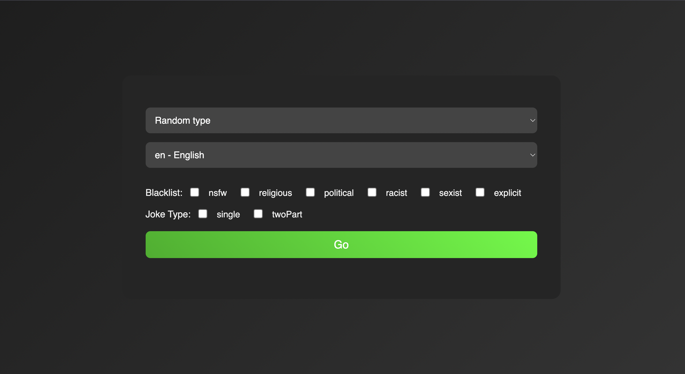
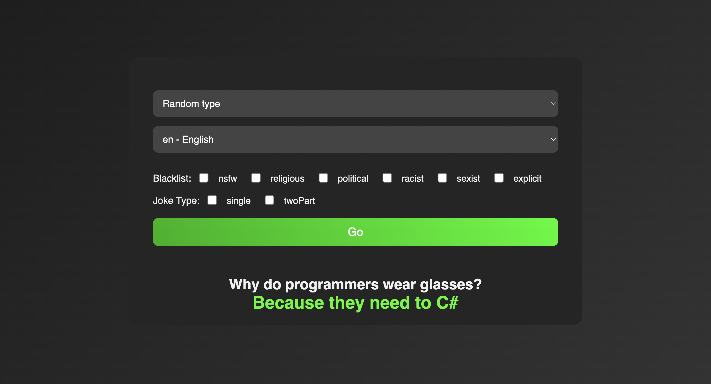

# Jokify

Jokify is a fun web app that fetches jokes in multiple languages, with options for joke types like single or two-part jokes. Whether you want a quick laugh or a clever punchline, Jokify delivers it!

## Features
- Random jokes fetched from an API
- Support for multiple languages (English, Spanish, French)
- Select different types of jokes (Single, Two-part)
- Blacklist functionality to exclude certain joke categories

## Installation

1. Clone the repository:

git clone https://github.com/sMayank21/jokify.git

2. Install dependencies:

npm i

3. Start the app:

nodemon index.js / node index.js

## Screenshots

## Technologies Used
- Node.js
- Express
- EJS
- Axios
- API: https://sv443.net/jokeapi/v2

## License
This project is licensed under the MIT License.